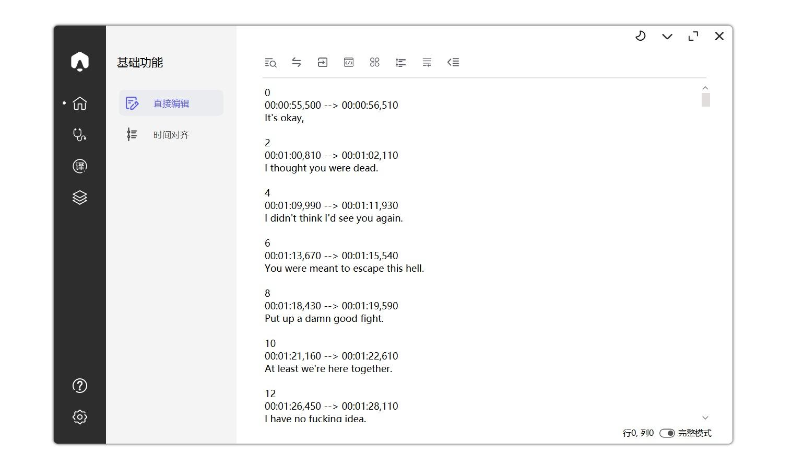
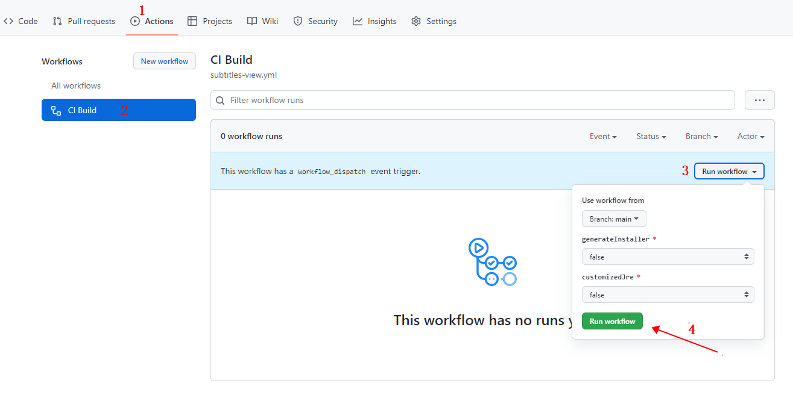

# Subtitles-View

[]()
[]()
[](https://github.com/fordes123/Subtitles-View/releases)
[](https://opensource.org/licenses/MIT)
&nbsp;

这是一个基于`JavaFX`的程序，致力于简单、优雅、高效处理和编辑字幕。适配SRT、ASS等字幕格式，并且支持视频语音转换与字幕翻译，欢迎体验.


## ✨ 特性

- 🎁 现代化的界面，简洁明快
- 🦄 在线语音转换，简单为视频生成字幕并翻译
- ☑️ 多种视频与字幕格式支持
- ✏ 便捷化字幕编辑功能，帮助快速修正机器翻译
- 🎯 在线的字幕搜索与下载
- 🎈 深色浅色模式一键切换
- ⛏ 更多特性待开发...

## 🎉 应用界面



## ☑️ TODO

- [x] 框架搭建以及迁移重构
- [x] UI调整，深浅色跟随系统等
- [x] 字幕搜索、下载支持：`字幕库`、`伪射手网`、`A4k字幕网`
- [x] 文字翻译服务适配：`百度翻译`、`阿里翻译`、`腾讯翻译`、`火山翻译`
- [ ] 语音转换服务适配
- [ ] 简单的视频处理支持，如字幕分离、水印、格式转换等

## 🧑🏻‍🔧技术栈

- `Maven`
- `JavaFX`
- `SpringBoot`
- `SQLite`
- `Mybatis-Plus`

## 📢 项目说明

- 兴趣之作，欢迎提出任何修改意见，但不保证任何更新以及功能的可靠性
- 设计支持跨平台，但未经测试，现阶段以`Windows`平台为主
- 程序无任何收费和用户信息收集行为。所有在线服务如：语音转写、在线翻译均为第三方提供，与本程序无关

## 🛠 快速开始

### 从源代码构建

```shell
# 请保证你的JDK版本不低于11，否则无法通过编译
git clone https://github.com/fordes123/subtitles-view.git
cd subtitles-view
mvn clean install
mvn run
```

或者

fork 本项目, 在 `WorkFlows` 中运行 `CI Build`, Github Action 将根据配置自动为你构建对应程序包
<details>
<summary>查看引导</summary>

</details>

### 获取可执行文件

- 正式发行版 [🚀 Releases](https://github.com/fordes123/Subtitles-View/releases/)
- 自动构建的测试版 [🤖 CI](https://github.com/fordes123/subtitles-view/actions)

（由于正在积极开发中，暂时没有 Release 版本，预览以及体验可使用 CI 版本）

## 🤝 交流反馈

- 提交 [📌Issues](https://github.com/fordes123/Subtitles-View/issues)
- 博客评论区 [📌Blog Page](https://blog.fordes.top/archives/subtitles-view.html)

## 📜 开源许可

- 基于 [MIT license](https://opensource.org/licenses/MIT) 许可进行开源。
